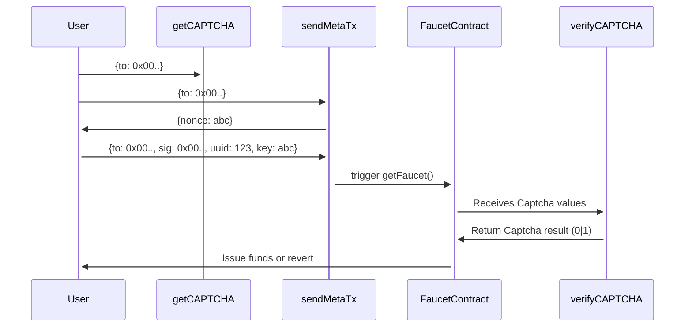

# Boba Mainnet Faucet
Using ImageCaptcha

## Successful User flow

### Foundry commands
Use `--no-commit --no-git` for all commands.

### Deployment
- Ensure `IS_LOCAL` is set to False, otherwise the `getCAPTCHA` endpoint will return the already solved captcha!

#### MetaTxApi
The MetaTxAPI has been rewritten to JavaScript since the Python-Web3 library doesn't have an implementation for estimating gas for signed transactions which makes it unusable to send HybridCompute transactions.

