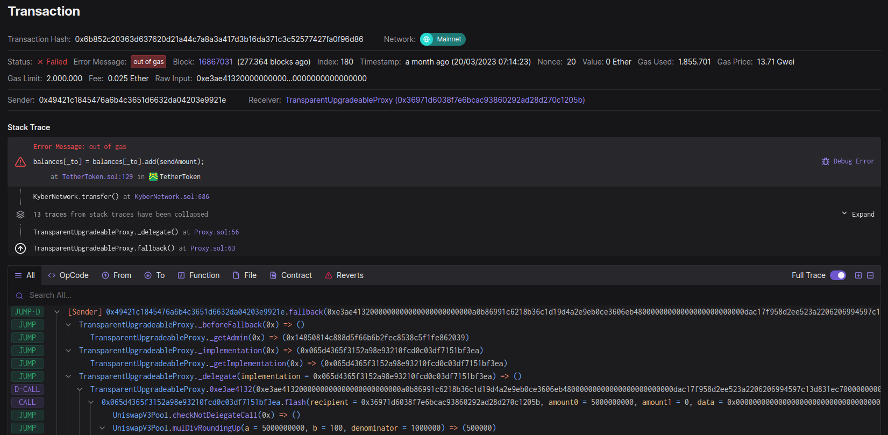
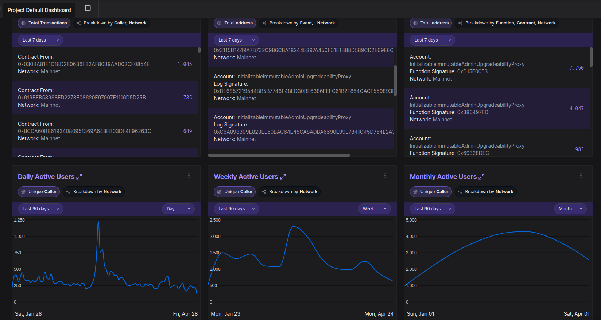
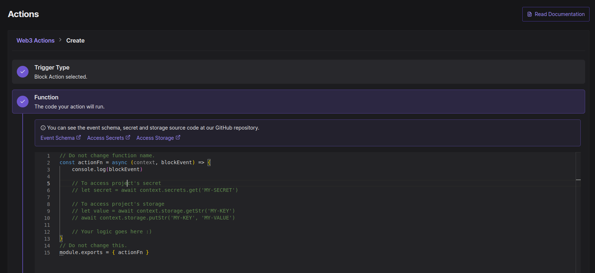

# What is Tenderly?
[Tenderly](https://tenderly.co/) is a great platform that supports your Web3 development efforts. It helps developers to build, test, monitor and operate their smart contracts.

## What you can do
Tenderly is enabled on all active Boba networks.

Here are some core features you may want to have a look at:
- [Monitoring](https://tenderly.co/monitoring)
- [Alerting](https://tenderly.co/alerting)
- [Web3 Gateway](https://tenderly.co/web3-gateway)
- [Web3 Actions](https://tenderly.co/web3-actions)
- [Simulator](https://tenderly.co/transaction-simulator)
- [War Rooms](https://tenderly.co/war-room)
- [Analytics](https://tenderly.co/analytics)

## Some examples

### Debug transactions
Know why your transactions are failing and discover issues in no time:

### On-chain analytics
Monitor your smart contracts and analyze user behavior.

### Web3 Actions
Trigger server-side actions on new blocks, certain smart contract events, failed transactions and other configurable events.

