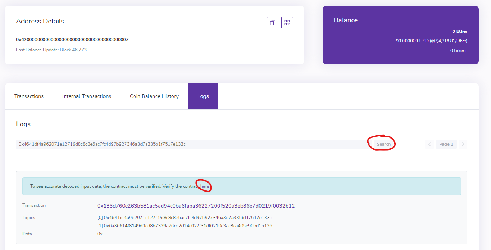
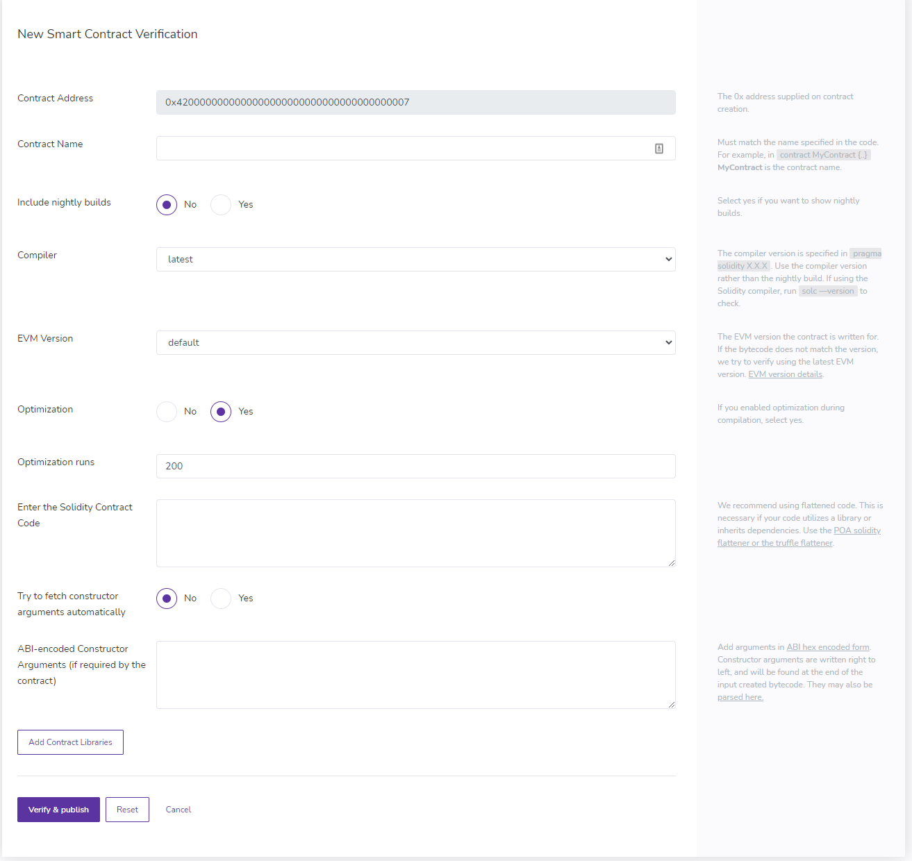

The Boba Explorer supports verifying smart contracts. The Mainnet Boba Explorer is [here](https://blockexplorer.boba.network) and the Rinkeby Testnet Explorer is [here](https://blockexplorer.rinkeby.boba.network). Take note that you can also verify contracts via [Sourcify](https://sourcify.dev).

## Steps

Navigate the logs section of the deployer address:

[Rinkeby](https://blockexplorer.rinkeby.boba.network/address/0x4200000000000000000000000000000000000007/logs)

[Mainnet](https://blockexplorer.boba.network/address/0x4200000000000000000000000000000000000007/logs)

Once you have provided all the necessary information, hit 'Verify & Publish'

