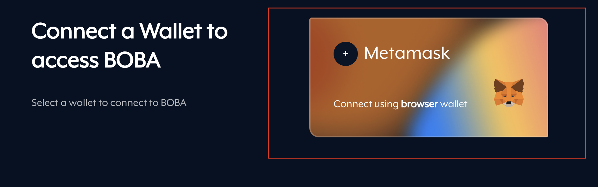
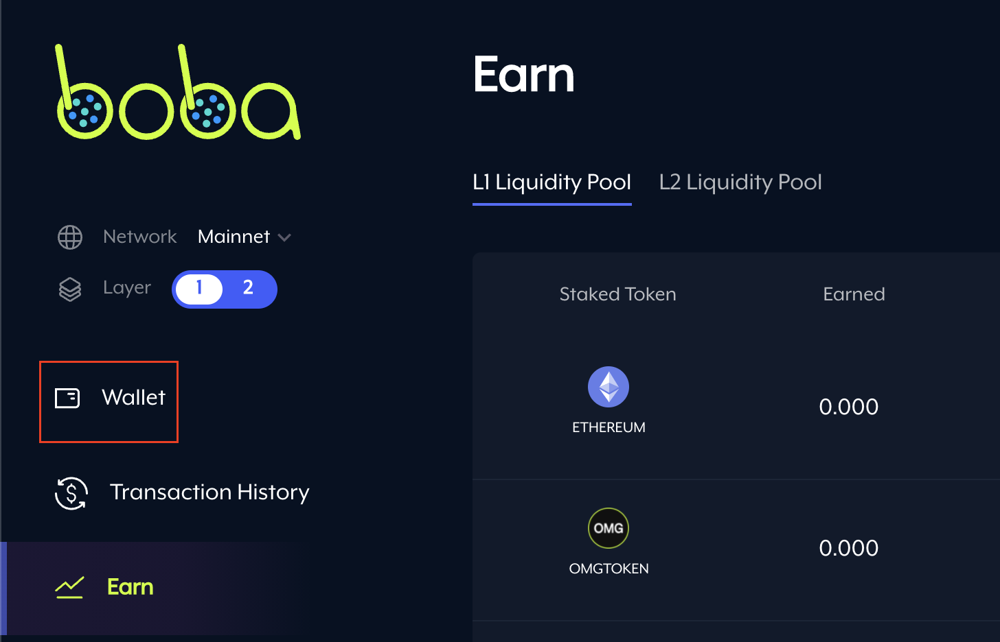
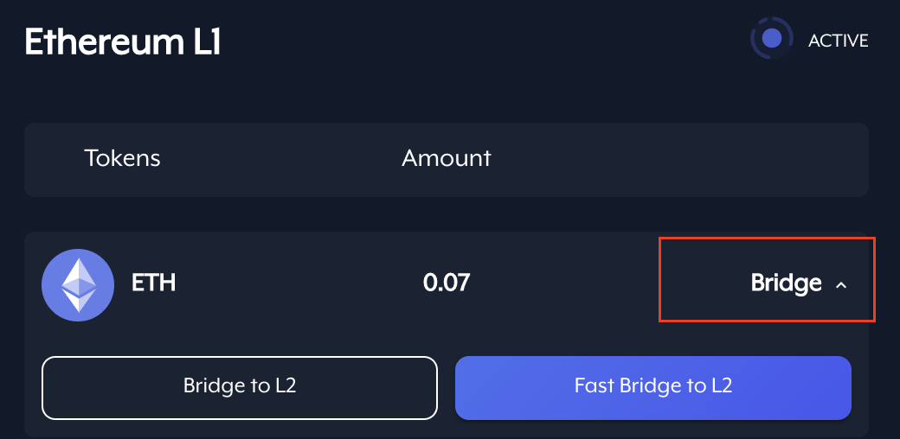
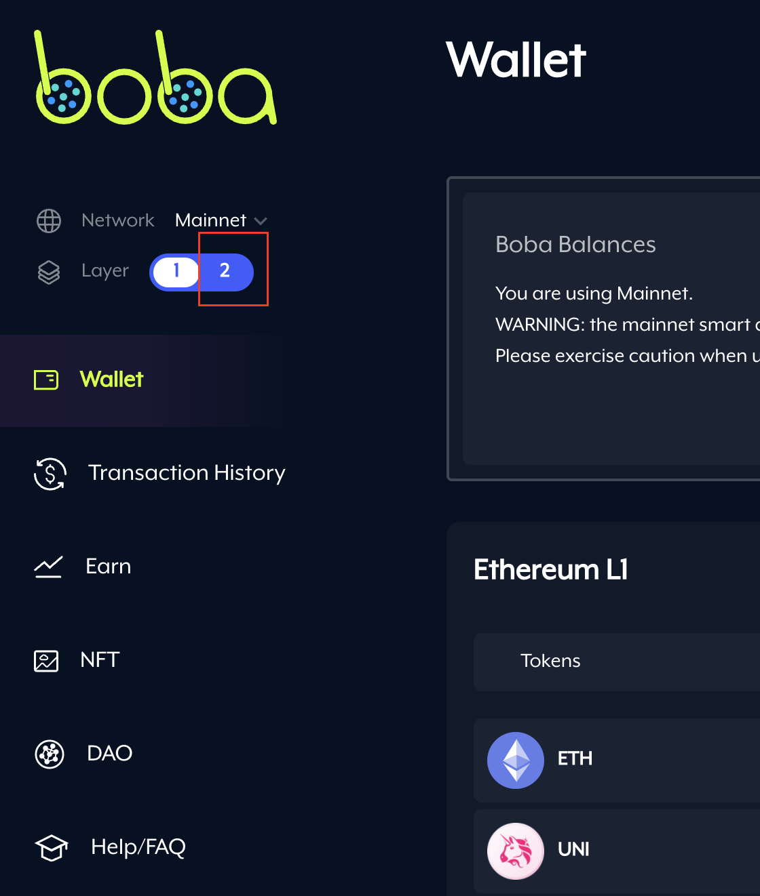
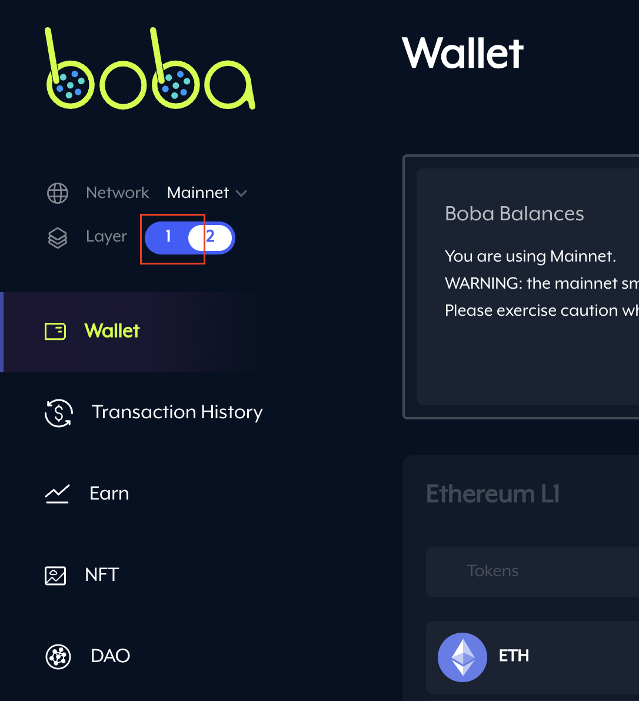

# How To Bridge


**Before getting started, make sure you have enough ETH in your Metamask wallet to approve and send transactions (we recommend 0.05 ETH).**



**Make sure you bridge both ETH and OMG to Boba so that you have ETH to exit later on. Transaction fees on Boba are paid in ETH.**



**If you use a Ledger HW wallet, make sure Ledger Firmware, Ledger ETH App, Ledger Live, and Metamask are all updated to the latest version and smart contracts are enabled in your Ledger Ethereum App!**


## How to bridge to Boba L2

1\) Go to [https://gateway.boba.network/](https://gateway.boba.network)

2\) Connect your Metamask wallet&#x20;

3\) Click on 'Wallet' on the navigation bar on the left&#x20;

4\) Click 'Bridge' next to the token you want to bridge to Boba&#x20;

5\) Choose 'Bridge' or 'Fast Bridge' - fast bridge is faster but charges 0.1% LP fee&#x20;

6\) Type in the amount you want to bridge

7\) Approve your **spend amount** in Metamask. Don't edit the gas fees, your transaction might fail.

8\) Approve **the transaction** in Metamask one more time. Don't edit the gas fees, your transaction might fail.

.png>)

## How to change Metamask network

1\) Switch your Metamask to Boba L2 network by clicking the Layer 2 button

2\) Confirm that you want to change networks

3\) If you want to switch back to Layer 1, simply click on the Layer 1 icon again and confirm the network switch in Metamask once again

## Manually add the Boba L2 network

1\) Under Metamask settings > networks, click add network

2\) Follow these settings

.png>)
