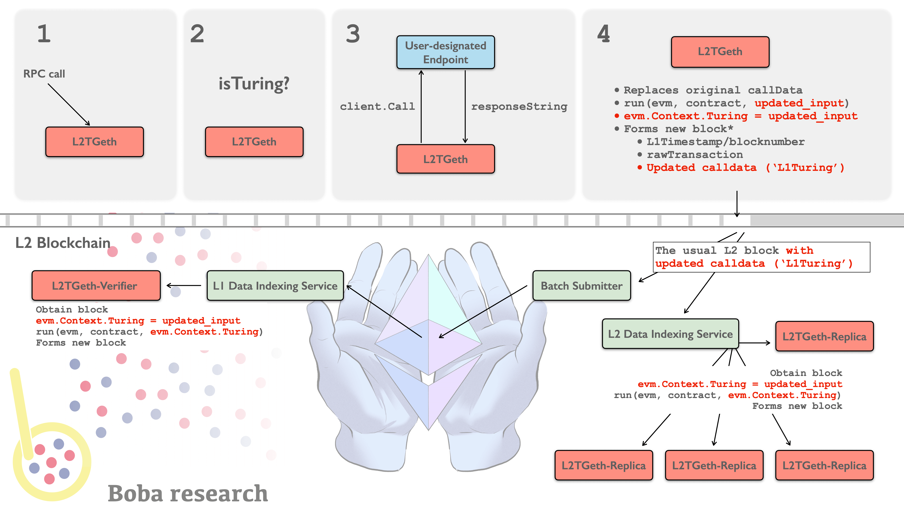

## What is Boba Network?

[Boba](https://boba.network) a compute-focused L2. Fundamentally, Ethereum is a distributed computer. We believe that L2s can play a unique role in augmenting the base _compute_ capabilities of the Ethereum ecosystem. You can learn more about Turing hybrid compute [here](./packages/boba/turing/README.md).



Boba is built on the Optimistic Rollup developed by [Optimism](https://optimism.io). We chose to build on Optimism because it is essentially a modified version of Ethereum, which makes it relatively easy to ensure EVM and Solidity compatibility, minimizing the efforts required to migrate smart contracts from L1 to L2.

### Is Boba a side chain?

Boba is not a side chain. Side chains are their own blockchain systems with entirely separate consensus mechanisms. Boba Network lives _inside_ of Ethereum as a series of smart contracts that are capable of executing Ethereum transactions. Whereas side chains rely on their own consensus mechanisms for security, Boba, as a child chain, instead relies on the security of Ethereum itself.

### What's the difference between Boba and Ethereum?

Boba is mostly identical to Ethereum. You can create and interact with Solidity smart contracts (just like you would on Ethereum) using the same wallet software you're already familiar with.

### Is Boba safe?

Boba Network is just as safe as the Ethereum chain. Optimistic Rollups are safe as long as Ethereum itself is "live" (not actively censoring transactions). This security model is backed by a system of "fraud proofs," whereby users are paid to reveal bad transaction results published to the Boba Optimism based chain.

### Is there a delay moving assets from Boba to Ethereum?

We developed a swap-based mechanism to deliver a smooth user experience for moving funds across chains, whether you are going from L1 to L2, L2 to L1, or between two L2s (as long as they are both EVM-compatible).

The users who choose to take advantage of this benefit will pay a small convenience fee that is shared among the liquidity providers of the pools backing the swaps. Acting as liquidity providers as described above is just the first of several staking opportunities we will roll out to the community. The higher level goal is to encourage broad-based participation in the operations and governance of Boba. As the only tokenized EVM-compatible L2, we are in a unique position to use our token responsibly for the long-term sustainability of the network.

### How are developers incentivized to build on Boba?

While the high gas fees of Ethereum itself act as a pretty strong incentive for developers to move to layer 2s in general. As for Boba specifically, our pitch to them is: this is not just about scaling Ethereum. Once you’re on Boba Network, we’re also creating this amazing future for you. You’ll be able to tap into more advanced compute capabilities that are not available to you today. We also have plans to create an ecosystem fund to incentivize some of the early-stage projects who are just starting out but doing something really interesting. It’s going to take some time to put something like that together. That’s in our plans.

### How do I connect my wallet to Boba Network?

Many wallets now allow applications to trigger a popup to switch between networks. If your wallet supports this feature then you will be automatically prompted to switch networks when an application wants to utilize a Boba Ethereum network. You can use the bridges to add the network to your wallet right here:

\* [Click here for Boba Network Ethereum, the **production** network](https://gateway.boba.network).

\* [Click here for Boba Network Rinkeby, the **test** network](https://gateway.rinkeby.boba.network).

If your wallet does not support this feature, you will have to connect manually. The exact process for connecting your wallet to a Boba Ethereum network depends on the specific wallet software you're using.

### How do I move assets into or out of Boba Network?

To move assets into or out of an Optimistic Ethereum network you can use the [**Boba Gateway**](https://gateway.boba.network). We have detailed instructions in our [user documentation](./boba_documentation/user/001_how-to-bridge.md). If you are a developer, there are two methods, the **classical bridge** and the **fast bridge** [more information](./boba_documentation/developer/bridge-l1-and-l2/bridge-basics.md).

### Can I cancel a withdrawal after it has been submitted?

**No, withdrawals currently cannot be cancelled once submitted.**

### Can I transfer directly from Boba to a centralized Exchange?

Only if the centralized exchange supports Boba Network (at writing none of them do). Otherwise you have to bridge your assets into a network they do support, such as L1.

### Where can I find RPC endpoints and connection details?

Connection details for our Mainnet and Rinkeby network can be found [here](./boba_documentation/developer/network_parameters.md).

./boba\_documentation/developer/xdomain-tx-status.md

### Are multicall contracts supported on Boba?

Yes, however you will have to deploy your own version.

### What are the token decimals on L2 Boba?

The token decimals on Boba L2 are the same as on Ethereum L1. So if the token has 6 decimals on L1, it will have 6 decimals on L2.

You can check decimals using the [blockexplorer](https://blockexplorer.boba.network), for example:

`https://blockexplorer.boba.network/tokens/0x66a2A913e447d6b4BF33EFbec43aAeF87890FBbc/token-transfers`

You can also check the decimals by calling the token contracts:

```javascript
const decimals = await this.ERC20_Contract.attach(tokenAddress).connect(this.L2Provider).decimals()
//typical values are 18 or, in some rare but important cases, 6
```

### The incentive contract for verification proofs is disabled

In the current release of the Boba Network protocol, there may be rare cases in which the Sequencer submits a state root (transaction result) which is invalid and therefore could be challenged. As a result, we have not yet deployed the [Bond Manager](./packages/contracts/contracts/optimistic-ethereum/OVM/verification/OVM\_BondManager.sol) contract which compensates Verifier nodes for gas spent when submitting state root challenges. Additionally, our upgrade keys have the ability to directly remove state roots without going through an uncompensated state root challenge.

### Boba operates the only "Sequencer" node

A Sequencer node is a special node in an Optimistic Ethereum network that can order transactions on short timescales (on the order of minutes). This opens up the door to very fast transaction confirmation times with strong guarantees about finality. Eventually, the operator of the Sequencer node on a network will be determined by some governing mechanism. For now, Boba Network operates the only such node.

### What is the Gas Price on Boba L2?

The Gas Price on L2 changes every **30 seconds** with some smoothing to reduce sharp discontinuities in the price from one moment to the next. The maximum percentage change from one value to another is capped to not more than 5% in the gas price oracle. For example, if the current `gasPrice` is 10 Gwei then the next `gasPrice` will be between 9.5 and 10.5 Gwei. Like on mainchain, the current gas price can be obtained via `.getGasPrice()` and is typically around 10 Gwei.

### Do you support EIP-2470: Singleton Factory?

Yes! [ERC-2470](https://eips.ethereum.org/EIPS/eip-2470) is deployed to `0xce0042B868300000d44A59004Da54A005ffdcf9f` on the Boba L2. The address on the Boba L2 is the same as on Ethereum mainnet.

### How do I follow cross domain (xDomain) transactions and their status?

There are 4 different mechanisms for following the status of a transaction.

1. The Boba Blockexplorer (for L2) and Etherscan (for L1)
2. Running a typescript `watcher`
3. Using the Boba `watcher-api`
4. Third-party analytics

These methods are described [here](./boba_documentation/developer/xdomain-tx-status.md).
