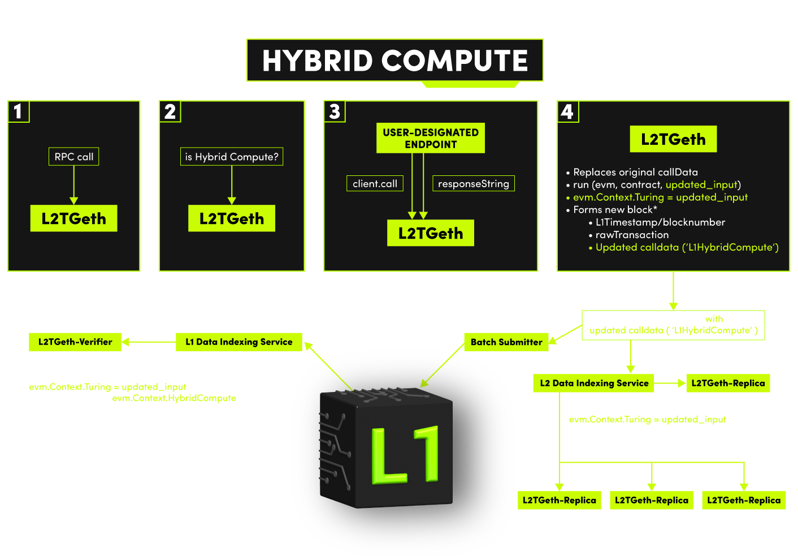

# FAQ

<a href="link" style="text-align:center">
  
</a>

<!--  -->

[Boba](https://boba.network) is a compute-focused Layer 2 (L2) solution built on top of the Layer 1 blockchain, [Ethereum](https://ethereum.org/en). Boba scales and augments the core _compute_ capabilities of Ethereum, reducing gas fees and improving transaction throughput - while retaining the security guarantees of Ethereum.

The complexity of smart contract algorithms can make them expensive and slow to execute at speed. To solve this, Boba has designed a Hybrid Compute architecture that enables smart contracts to trigger much more complex algorithms off-chain (similar to running an app on AWS for example), and then bring the result back into the on-chain smart contract. Hence, the Boba Hybrid compute model runs both on-chain and off-chain.



Boba is built on the Optimistic Rollup developed by [Optimism](https://optimism.io). Boba chose to build on Optimism because it is essentially a modified version of Ethereum that makes it relatively easy to ensure Ethereum Virtual Machine (EVM) and Solidity compatibility. This minimizes the efforts required to migrate smart contracts from L1 to L2.

## Is Boba a side chain?

Boba is not a side chain. Side chains are their own blockchain systems with entirely separate consensus mechanisms. Boba Network lives _inside_ of Ethereum as a series of smart contracts that are capable of executing Ethereum transactions. Side chains on the other hand rely on their own consensus mechanisms for security.  Boba as a child chain instead relies on the security of Ethereum itself.

## What's the difference between Boba and Ethereum?

Boba is similar to Ethereum. Just like you would on Ethereum, you can create and interact with Solidity smart contracts using the same wallet software you are already familiar with.

## Is Boba safe?

Boba Network is just as safe as the Ethereum chain. Optimistic Rollups like Boba are safe as long as Ethereum itself is "live" (that is, not actively censoring transactions). This security model is backed by a system of "fraud proofs" whereby users are paid to reveal bad transaction results published to the Boba Optimism based chain.

## Is there a delay moving assets from Boba to Ethereum?

Boba has developed a swap-based mechanism to deliver a smooth user experience for moving funds across chains. Porting assets from L1 to L2, L2 to L1, or between two L2s (as long as they are both EVM-compatible), is fast and dependable.

The users who choose to take advantage of this bridging between L1 and L2 will pay a small convenience fee that is shared among the liquidity providers of the pools backing the swaps. Acting as liquidity providers is just the first of several staking opportunities Boba will roll out to the community. The higher level goal is to encourage broad-based participation in the operations and governance of Boba. As the only tokenized EVM-compatible L2, Boba is in a unique position to use the Boba token responsibly for the long-term sustainability of the network.

## How are developers incentivized to build on Boba?

The high gas fees of Ethereum itself is a pretty strong incentive for developers to move to layer 2 networks like Boba. Boba not only helps you scale Ethereum, but also helps tap into more advanced compute capabilities that are not available to you today. Boba also has plans to create an ecosystem fund to incentivize some of the early-stage projects that are just starting out and plan to launch something really interesting. It’s going to take some time to put something like that together. That’s in our plans.

## How do I connect my wallet to Boba Network?

Many wallets now allow applications to trigger a popup to switch between networks. If your wallet supports this feature, you will be automatically prompted to switch networks when an application wants to utilize a Boba Ethereum network. You can use these bridges to add the network to your wallet:

\* [The Boba **production** Network Ethereum](https://gateway.boba.network).

\* [The Boba **test** Goerli Network](https://gateway.goerli.boba.network).

If your wallet does not support this feature, you will have to connect manually. The exact process for connecting your wallet to a Boba Ethereum network depends on the specific wallet software you are using.

## How do I move assets into or out of Boba Network?

To move assets into or out of an Optimistic Ethereum network you can use the [**Boba Gateway**](https://gateway.boba.network). We have detailed instructions in our [user documentation](./boba_documentation/user/001_how-to-bridge.md).
If you are a developer, you can choose any of these two methods: [the **classical bridge**, or the **fast bridge**](./boba_documentation/developer/bridge-l1-and-l2/bridge-basics.md).

## Can I cancel a withdrawal after it has been submitted?

**No, withdrawals currently cannot be cancelled once submitted.**

## Can I transfer directly from Boba to a centralized Exchange?

Only if the centralized exchange supports Boba Network (at this time none of them do). Otherwise you have to bridge your assets into a network they do support, such as L1.

## Where can I find RPC endpoints and connection details?

Connection details for our Mainnet and Goerli network can be found [here](./boba_documentation/developer/network-parameters.md).

## Are multicall contracts supported on Boba?

Yes. However, you will have to deploy your own version.

## What are the token decimals on L2 Boba?

The token decimals on Boba L2 are the same as on Ethereum L1. So if the token has 6 decimals on L1, it will have 6 decimals on L2.

You can check decimals using the [blockexplorer](https://blockexplorer.boba.network).
Here's an [example](https://blockexplorer.boba.network/tokens/0x66a2A913e447d6b4BF33EFbec43aAeF87890FBbc/token-transfers).

You can also check the decimals by calling the token contracts:

```javascript
const decimals = await this.ERC20_Contract.attach(tokenAddress).connect(this.L2Provider).decimals()
//typical values are 18 or, in some rare but important cases, 6
```

## Why is the incentive contract for verification proofs disabled?

In the current release of the Boba Network protocol, there may be rare cases where the Sequencer submits a state root (transaction result) that is invalid and hence could be challenged. As a result, we have not yet deployed the [Bond Manager](./packages/contracts/contracts/contracts/L1/verification/BondManager.sol) contract which compensates Verifier nodes for gas spent when submitting state root challenges. Additionally, our upgrade keys have the ability to directly remove state roots without going through an uncompensated state root challenge.

## Does Boba operate the only "Sequencer" node?

A Sequencer node is a special node in an Optimistic Ethereum network that can order transactions on short timescales (on the order of minutes). This opens up the door to very fast transaction confirmation times with strong guarantees about finality. Eventually, the operator of the Sequencer node on a network will be determined by some governing mechanism. For now, Boba Network operates the only such node.

## What is the Gas Price on Boba L2?

The Gas Price on L2 changes every **30 seconds** with some smoothing to reduce sharp discontinuities in the price from one moment to the next. The maximum percentage change from one value to another is capped at no more than 5% in the gas price oracle. For example, if the current `gasPrice` is 10 Gwei then the next `gasPrice` will be between 9.5 and 10.5 Gwei. As on the mainchain, the current gas price can be obtained via `.getGasPrice()`, which is typically around 10 Gwei.

## Do you support EIP-2470: Singleton Factory?

Yes! [ERC-2470](https://eips.ethereum.org/EIPS/eip-2470) is deployed to `0xce0042B868300000d44A59004Da54A005ffdcf9f` on the Boba L2. The address on the Boba L2 is the same as on Ethereum mainnet.

## How do I follow cross domain (xDomain) transactions and their status?

There are [four different methods](./boba_documentation/developer/xdomain-tx-status.md) you can use for following the status of a transaction. You can:

1. use the Boba Blockexplorer (for L2), and Etherscan (for L1)
2. use the Boba `watcher-api`
3. run a typescript `watcher`
4. use third-party analytics

</br>

## 


## Q1: Why can't I Deploy my 100kb Copy/Paste Contract?

Instead of deploying just one contract, you need to deploy several.

## Q2: Are there any technical changes or differences in smart contracts and gas tables in Boba Network in comparison to BNB Smart Chain (BSC) or Ethereum Networks?

No, there is no difference.

## Q3: DEX (decentralized exchange) is built on 0.7.6. Is it safe to use Solc Optimization on it?

Yes!

## Q4: Is it all right with the Boba Network if the source code of our app is closed source?

Boba network is a permission-less network and hence we cannot influence app creators about the disclosure of their source code. However, we do advise end users not to interact with smart contracts that use source code that is not verified in the Blockexplorer.

## Q5: Is there a way to run arbitrarly compiled Smart Contract native code, or a Smart Contract in a WebAssembly (WASM) environment?

Unfortunately no, not at the moment.

## Q6: I am trying to deploy a Smart Contract to Boba Rinkeby with Remix but get this error: "creation of SCContract errored: \[ethjs-query] while formatting outputs from RPC '{"value":{"code":-32603,"data":{"code":-32000,"message":"invalid transaction: exceeds block gas limit"\}}}'

See Q2 of Transactions.
