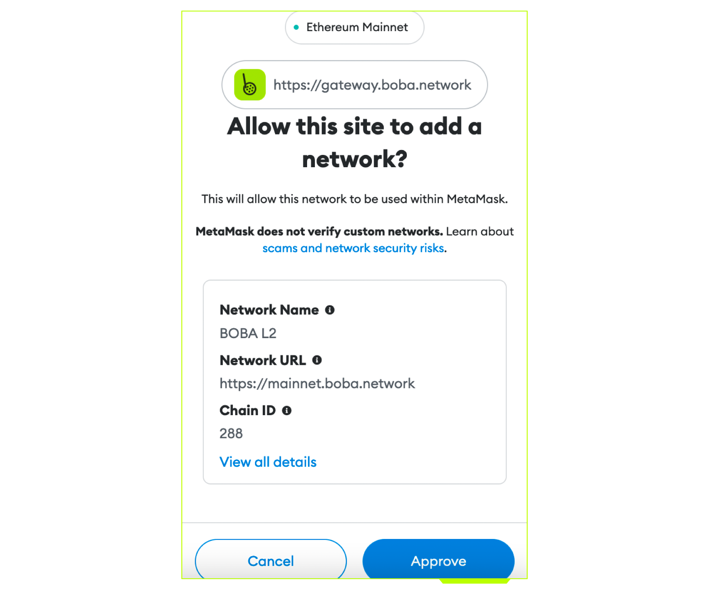
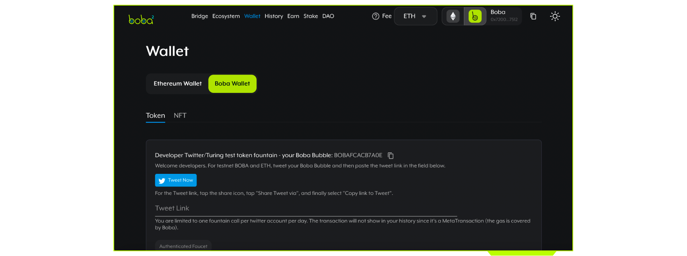
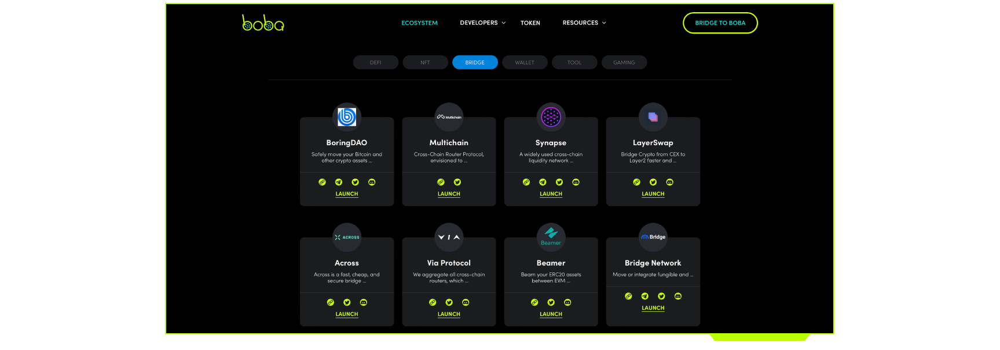

# FAQ

<a href="link" style="text-align:center">
  
</a>

<!--  -->

[Boba](https://boba.network) is a compute-focused Layer 2 (L2) solution built on top of the Layer 1 blockchain, [Ethereum](https://ethereum.org/en). Boba scales and augments the core _compute_ capabilities of Ethereum, reducing gas fees and improving transaction throughput - while retaining the security guarantees of Ethereum.

The complexity of smart contract algorithms can make them expensive and slow to execute at speed. To solve this, Boba has designed a Hybrid Compute architecture that enables smart contracts to trigger much more complex algorithms off-chain (similar to running an app on AWS for example), and then bring the result back into the on-chain smart contract. Hence, the Boba Hybrid compute model runs both on-chain and off-chain.


Boba is built on the Optimistic Rollup developed by [Optimism](https://optimism.io). Boba chose to build on Optimism because it is essentially a modified version of Ethereum that makes it relatively easy to ensure Ethereum Virtual Machine (EVM) and Solidity compatibility. This minimizes the efforts required to migrate smart contracts from L1 to L2.

## Is Boba a side chain?

Boba is not a side chain. Side chains are their own blockchain systems with entirely separate consensus mechanisms. Boba Network lives _inside_ of Ethereum as a series of smart contracts that are capable of executing Ethereum transactions. Side chains on the other hand rely on their own consensus mechanisms for security.  Boba as a child chain instead relies on the security of Ethereum itself.

## What's the difference between Boba and Ethereum?

Boba is similar to Ethereum. Just like you would on Ethereum, you can create and interact with Solidity smart contracts using the same wallet software you are already familiar with.

## Is Boba safe?

Boba Network is just as safe as the Ethereum chain. Optimistic Rollups like Boba are safe as long as Ethereum itself is "live" (that is, not actively censoring transactions). This security model is backed by a system of "fraud proofs" whereby users are paid to reveal bad transaction results published to the Boba Optimism based chain.

## Is there a delay moving assets from Boba to Ethereum?

Boba has developed a swap-based mechanism to deliver a smooth user experience for moving funds across chains. Porting assets from L1 to L2, L2 to L1, or between two L2s (as long as they are both EVM-compatible), is fast and dependable.

The users who choose to take advantage of this bridging between L1 and L2 will pay a small convenience fee that is shared among the liquidity providers of the pools backing the swaps. Acting as liquidity providers is just the first of several staking opportunities Boba will roll out to the community. The higher level goal is to encourage broad-based participation in the operations and governance of Boba. As the only tokenized EVM-compatible L2, Boba is in a unique position to use the Boba token responsibly for the long-term sustainability of the network.

## How are developers incentivized to build on Boba?

The high gas fees of Ethereum itself is a pretty strong incentive for developers to move to layer 2 networks like Boba. Boba not only helps you scale Ethereum, but also helps tap into more advanced compute capabilities that are not available to you today. Boba also has plans to create an ecosystem fund to incentivize some of the early-stage projects that are just starting out and plan to launch something really interesting. It’s going to take some time to put something like that together. That’s in our plans.

## How do I connect my wallet to Boba Network?

Many wallets now allow applications to trigger a popup to switch between networks. If your wallet supports this feature, you will be automatically prompted to switch networks when an application wants to utilize a Boba Ethereum network. You can use these bridges to add the network to your wallet:

\* [The Boba **production** Network Ethereum](https://gateway.boba.network).

\* [The Boba **test** Goerli Network](https://gateway.goerli.boba.network).

If your wallet does not support this feature, you will have to connect manually. The exact process for connecting your wallet to a Boba Ethereum network depends on the specific wallet software you are using.

## How do I move assets into or out of Boba Network?

To move assets into or out of an Optimistic Ethereum network you can use the [**Boba Gateway**](https://gateway.boba.network). We have detailed instructions in our [user documentation](./boba_documentation/user/001_how-to-bridge.md).
If you are a developer, you can choose any of these two methods: [the **classical bridge**, or the **fast bridge**](./boba_documentation/developer/bridge-l1-and-l2/bridge-basics.md).

## Can I cancel a withdrawal after it has been submitted?

**No, withdrawals currently cannot be cancelled once submitted.**

## Can I transfer directly from Boba to a centralized Exchange?

Only if the centralized exchange supports Boba Network (at this time none of them do). Otherwise you have to bridge your assets into a network they do support, such as L1.

## Where can I find RPC endpoints and connection details?

Connection details for our Mainnet and Goerli network can be found [here](./boba_documentation/developer/network-parameters.md).

## Are multicall contracts supported on Boba?

Yes. However, you will have to deploy your own version.

## What are the token decimals on L2 Boba?

The token decimals on Boba L2 are the same as on Ethereum L1. So if the token has 6 decimals on L1, it will have 6 decimals on L2.

You can check decimals using the [blockexplorer](https://blockexplorer.boba.network).
Here's an [example](https://blockexplorer.boba.network/tokens/0x66a2A913e447d6b4BF33EFbec43aAeF87890FBbc/token-transfers).

You can also check the decimals by calling the token contracts:

```javascript
const decimals = await this.ERC20_Contract.attach(tokenAddress).connect(this.L2Provider).decimals()
//typical values are 18 or, in some rare but important cases, 6
```

## Why is the incentive contract for verification proofs disabled?

In the current release of the Boba Network protocol, there may be rare cases where the Sequencer submits a state root (transaction result) that is invalid and hence could be challenged. As a result, we have not yet deployed the [Bond Manager](./packages/contracts/contracts/contracts/L1/verification/BondManager.sol) contract which compensates Verifier nodes for gas spent when submitting state root challenges. Additionally, our upgrade keys have the ability to directly remove state roots without going through an uncompensated state root challenge.

## Does Boba operate the only "Sequencer" node?

A Sequencer node is a special node in an Optimistic Ethereum network that can order transactions on short timescales (on the order of minutes). This opens up the door to very fast transaction confirmation times with strong guarantees about finality. Eventually, the operator of the Sequencer node on a network will be determined by some governing mechanism. For now, Boba Network operates the only such node.

## What is the Gas Price on Boba L2?

The Gas Price on L2 changes every **30 seconds** with some smoothing to reduce sharp discontinuities in the price from one moment to the next. The maximum percentage change from one value to another is capped at no more than 5% in the gas price oracle. For example, if the current `gasPrice` is 10 Gwei then the next `gasPrice` will be between 9.5 and 10.5 Gwei. As on the mainchain, the current gas price can be obtained via `.getGasPrice()`, which is typically around 10 Gwei.

## Do you support EIP-2470: Singleton Factory?

Yes! [ERC-2470](https://eips.ethereum.org/EIPS/eip-2470) is deployed to `0xce0042B868300000d44A59004Da54A005ffdcf9f` on the Boba L2. The address on the Boba L2 is the same as on Ethereum mainnet.

## How do I follow cross domain (xDomain) transactions and their status?

There are [four different methods](./boba_documentation/developer/xdomain-tx-status.md) you can use for following the status of a transaction. You can:

1. use the Boba Blockexplorer (for L2), and Etherscan (for L1)
2. use the Boba `watcher-api`
3. run a typescript `watcher`
4. use third-party analytics

</br>

## 


## Why can't I Deploy my 100kb Copy/Paste Contract?

Instead of deploying just one contract, you need to deploy several.

## Are there any technical changes or differences in smart contracts and gas tables in Boba Network in comparison to BNB Smart Chain (BSC) or Ethereum Networks?

No, there is no difference.

## DEX (decentralized exchange) is built on 0.7.6. Is it safe to use Solc Optimization on it?

Yes!

## Is it all right with the Boba Network if the source code of our app is closed source?

Boba network is a permission-less network and hence we cannot influence app creators about the disclosure of their source code. However, we do advise end users not to interact with smart contracts that use source code that is not verified in the Blockexplorer.

## Is there a way to run arbitrarly compiled Smart Contract native code, or a Smart Contract in a WebAssembly (WASM) environment?

Unfortunately no, not at the moment.

## exceeds block gas limit"\}}}'

Please see Q2 of Transactions.

</br>


## Does Boba Network Have a testnet/How do I gettTestnet Boba or Eth?

Boba Network does have a testnet and it uses authentication through Twitter. Here’s a short walkthrough on how to get authenticated.

First, download MetaMask on your browser as a plug-in and set up a MetaMask wallet.

Don’t be surprised by the fox that will follow your cursor when you first launch the application. He’s friendly.


After you’ve set up your MetaMask account, you can [connect to the Rinkeby network Testnet](https://gateway.rinkeby.boba.network/). After that, follow these steps:

* Notice your connection status being displayed in the upper-right corner, along with a button that will allow you to select a chain to connect to.
* Click on the Boba icon, and MetaMask will prompt you to connect to the Rinkeby Boba network.
* Click on the account you would like to use for your testnet, then hit Next.
* Allow permissions by hitting Connect.
* Observe that all of the network details such as the Network name, URL, and Chain ID have all been auto-filled.
* Hit Approve.



* Now that you’re connected to the network, you can authenticate with Twitter:



* Hit the Tweet Now button to tweet your _Boba Bubble_ token.
* Once your tweet is shared, copy the link leading to it.
* Paste the link to your tweet where you’re prompted to do so.

For more information on Boba’s testnet and fountain, [check out our documentation](https://docs.boba.network/for-developers/network-fantom#bobaopera-testnet-addresses).

**NOTE: You can only make one fountain call per Twitter account, per day.**

## I am trying to run Boba Network locally and  I am able to run unit tests. However, integration tests give an error:

`./scripts/wait-for-sequencer.sh is getting timed out. Any Solutions?`

Please be sure to attach logs of output of `docker-compose logs` as well as integration tests. That should solve the problem.

## I have started deploying Boba Testnet, but it looks like the Testnet Subgraph is private?

We have the graph node on Ethereum Mainnet L2 and Rinkeby L2. The Rinkeby graph node is public. The Mainnet graph node is hosted by The Graph team.

<br/>


## Why isn’t my transaction going through?

Although you will get an error message that says the gas limit is 1,000,000,000,000,000 Wei, the Boba Network will throw an error anytime the gas price is equal to or more than three times the expected gas price for any given transaction.

When you make an Ethereum transaction, the user will be given an expected fee for what they can expect that transaction to cost. Say you’re about to transfer some Ethereum into your friend’s account. And you’re given an expected transaction fee of 3 USD. If, for whatever reason (because the market changes quickly), the gas prices sky-rocket, and now the transaction fee is 9 USD, you’re going to receive an error message.

The reason why is because Boba is looking out for you. Before that unexpectedly expensive payment goes through, Boba will throw an error and prevent the payment from going through to make sure you aren’t paying more than you should be. If the transaction fee is at least three times what the expected cost was (in our example, your transaction fee of 3 USD jumped to 9 USD), the transaction will fail before you’re faced with that kind of payment.

[Read up on the documentation](https://docs.boba.network/for-developers/fee-scheme#for-frontend-and-wallet-developers) to find out more.

## The Dapp Requires an Approximate XZY Gas to Deploy, Boba's Block Gas Limit is Only 11,000,000, Making it Impossible to Deploy the DEX. What Can Be Done to Deploy the DEX on Boba?

Try to increase higher solc optimizations. For more clarification, check out the Solidity documentation or break down contracts into smaller chunks.

## How Can I Pay for Fees with BOBA Via an API?

Below is the js code needed to utilize the API:

```
const registerTx = await Boba_GasPriceOracle.useBobaAsFeeToken()
   await registerTx.wait()
```

## In the Other Blockchains That an ICO Was Made On, the Payment Coin Was the Blockchain’s Default Gas Coin. In Boba’s Case, the Coin is Ethereum. Shouldn’t the Option to Pay via Boba Token Be Added as Well?

Boba Network fees can be paid in Boba token and in Eth and it's in our End Users’ own discretion to decide which to use.

## When Making a Transaction on Boba and Paying Transaction Fee with Boba, is the Fee First Calculated in ETH at a Gas Price of 1 GWEI, Then Converted to Boba With a 25% Discount?

Yes, exactly!

## Do You Recommend Solidity Optimization, as the Max Value of Runs is 2^32 - 1? What Happens if the DEX Gets More Transactions Than That?

Optimization does not mean that there’s a limit set to the number of transactions this DEX can process.

[Check out Solidity’s official documentation for more information.](https://blog.soliditylang.org/2020/11/04/solidity-ama-1-recap/)

You can also [read up on using compilers and optimization options](https://docs.soliditylang.org/en/v0.8.4/using-the-compiler.html#optimizer-options) in Solidity’s documentation as well.

## Does Boba Network have a public TheGraph Node for deploying Subgraphs?

Please refer to the Boba docs on using The Graph (https://docs.boba.network/for-developers/subgraph).

## Which bridge does Boba Network use?

There are multiple bridges available and are listed on our ecosystem page:



<br/>

[On the Boba Network page](https://gateway.boba.network/), click the Ecosystem link in top menu to navigate to the list available bridges.

<br/>


## What are the limits on Hybrid Compute Web2 calls?

This //docs.boba.network/turing/turing#important-properties-of-turing). Be sure to read up and check it out!

## If Hybrid Compute is automatic, does that mean contract execution now waits on API response? How long can an endpoint delay execution? Won't this hit the API endpoint even in cases of Simulations/Reverts?

First, [check out the documentation](https://docs.boba.network/turing/turing#important-properties-of-turing), it should clear up any confusion you may have about our Hybrid Compute.

Hybrid Compute calls need to execute estimateGas first. This puts the API response in a short lived cache, out of which the result is fetched in transaction processing.

## When using the Hybrid Compute feature, the transaction on metamask pops up, and if I submit it within a few seconds, everything works. However, waiting longer and submitting results in failure. Why does this happen?

That's because the Hybrid Compute feature puts the Hybrid Compute response in a cache bucket. Your request including a Hybrid Compute request will put the response under a cache key that expires in 5 seconds:

`const turingCacheExpire = 5 \* time.Second`

[You can see more about this in the documentation.](https://github.com/bobanetwork/boba/blob/develop/l2geth/core/vm/evm.go#L277)

## Is it possible to hide the API Key on Boba Hybrid Compute?

Not directly at the moment. We propose all authenticated calls that need API keys and similar go through a proxy/gateway that would act as an authentication layer for the caller - if that's a suitable design.