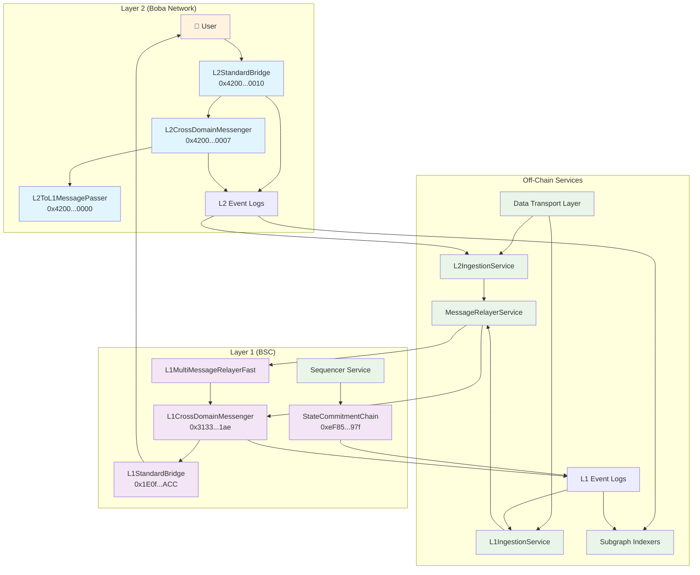
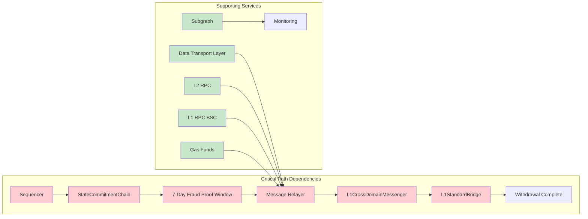
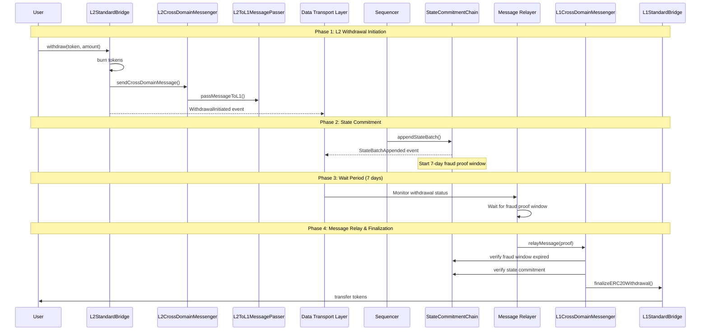
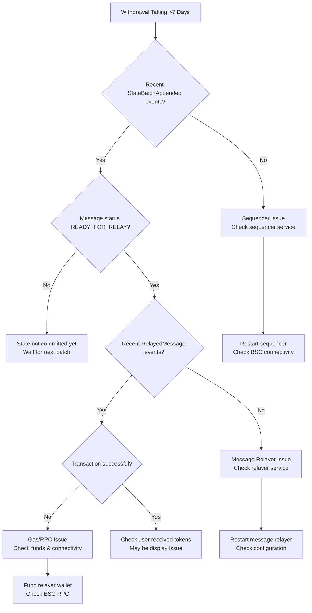

# Boba Network System Architecture

## System Component Diagram



## Service Dependencies



## Data Flow Sequence



## Component Responsibilities

| Component                  | Primary Responsibility               | Failure Impact                   |
| -------------------------- | ------------------------------------ | -------------------------------- |
| **L2StandardBridge**       | Initiate withdrawals, burn tokens    | Users can't start withdrawals    |
| **L2CrossDomainMessenger** | Encode cross-domain messages         | Message format errors            |
| **L2ToL1MessagePasser**    | Store message hashes                 | Withdrawal proofs fail           |
| **Sequencer**              | Submit state batches to L1           | No withdrawals can progress      |
| **StateCommitmentChain**   | Store L2 state, enforce fraud window | Withdrawals can't be proven      |
| **Data Transport Layer**   | Sync L1/L2 events                    | Services lose visibility         |
| **Message Relayer**        | Process withdrawals after window     | Withdrawals stuck at ready state |
| **L1CrossDomainMessenger** | Verify and execute withdrawals       | Final step fails                 |
| **L1StandardBridge**       | Release tokens to users              | Users don't receive funds        |

## Monitoring Points

### Critical Health Checks

1. **State Batch Frequency**
   
   - Monitor: `StateBatchAppended` events on StateCommitmentChain
   - Alert: No batches for > 1 hour
   - Contract: `0xeF85fA550e6EC5486121313C895EDe1005e2397f`

2. **Message Relayer Activity**
   
   - Monitor: `RelayedMessage` events on L1CrossDomainMessenger
   - Alert: No relays for ready messages
   - Contract: `0x31338a7D5d123E18a9a71447136B54B6D28241ae`

3. **Service Uptime**
   
   - Monitor: DTL L1/L2 ingestion services
   - Monitor: Message relayer service
   - Alert: Process not running

### Performance Metrics

- **Average Withdrawal Time**: Should be ~7 days
- **State Batch Interval**: Should be ~30 minutes
- **Message Processing Lag**: Should be <1 hour after fraud window
- **Failed Relay Rate**: Should be <1%

## Configuration Overview

### Boba BNB Network Settings

```yaml
Network: Boba BNB (Chain ID: 56288)
L1 Network: BSC (Chain ID: 56)
Fraud Proof Window: 604800 seconds (7 days)
Sequencer Publish Window: 1800 seconds (30 minutes)

Key Contracts:
  L2StandardBridge: 0x4200000000000000000000000000000000000010
  L1StandardBridge: 0x1E0f7f4b2656b14C161f1caDF3076C02908F9ACC
  StateCommitmentChain: 0xeF85fA550e6EC5486121313C895EDe1005e2397f
  L1CrossDomainMessenger: 0x31338a7D5d123E18a9a71447136B54B6D28241ae
```

## Troubleshooting Decision Tree



---

This architecture documentation provides a complete technical overview of how all the components work together in the Boba Network withdrawal system.
