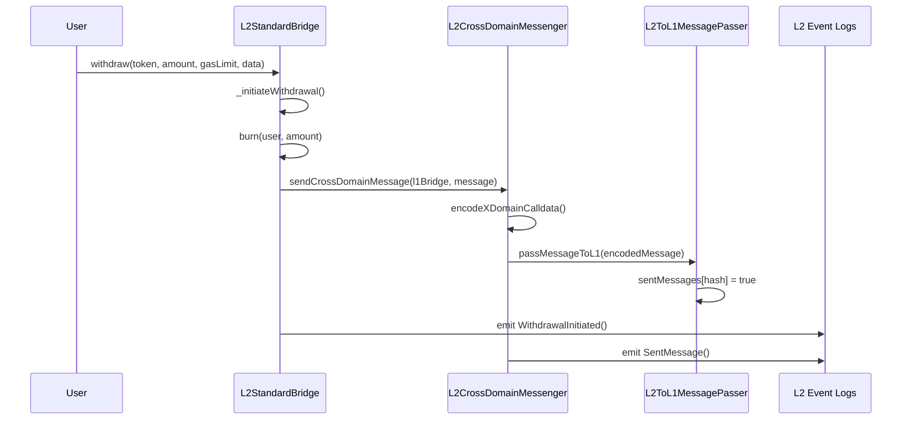
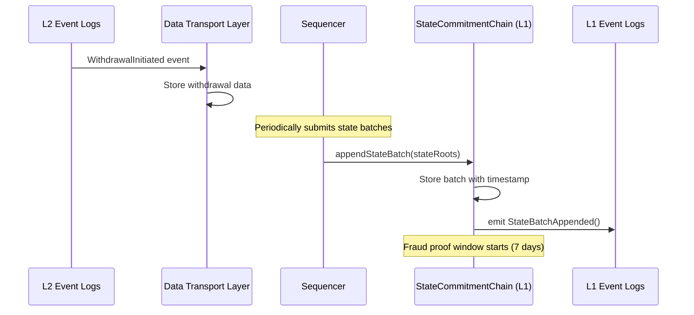
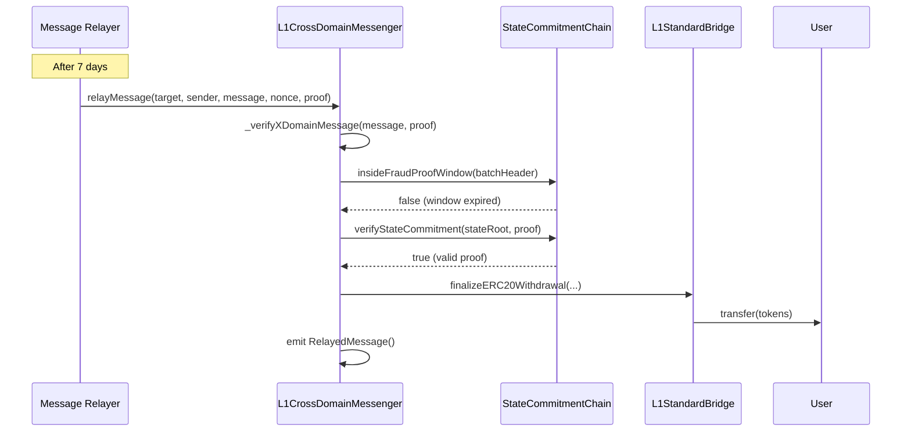

# Boba Network Withdrawal Flow - Complete Learning Guide

## Table of Contents

1. [Overview](#overview)
2. [System Components](#system-components)
3. [Complete Withdrawal Flow](#complete-withdrawal-flow)
4. [Service Dependencies](#service-dependencies)
5. [Smart Contract Interactions](#smart-contract-interactions)
6. [Timing and Challenge Period](#timing-and-challenge-period)
7. [Troubleshooting Guide](#troubleshooting-guide)
8. [Code References](#code-references)

## Overview

Boba Network uses an optimistic rollup design where withdrawals from L2 to L1 require a **7-day challenge period** for security. This document explains the complete flow from when a user initiates a withdrawal until they receive their tokens on L1.

### Key Concepts

- **Optimistic Rollup**: Assumes transactions are valid unless challenged
- **Fraud Proof Window**: 7-day period where transactions can be challenged
- **State Commitment**: L2 state is periodically committed to L1
- **Cross-Domain Messaging**: Communication mechanism between L2 and L1

## System Components

### Smart Contracts

#### L2 Contracts

```
L2StandardBridge (0x4200000000000000000000000000000000000010)
├── Handles withdrawal initiation
├── Burns L2 tokens
└── Sends cross-domain messages

L2CrossDomainMessenger (0x4200000000000000000000000000000000000007)
├── Encodes cross-domain messages
└── Interfaces with L2ToL1MessagePasser

OVM_L2ToL1MessagePasser (0x4200000000000000000000000000000000000000)
└── Stores withdrawal message hashes
```

#### L1 Contracts (BSC for Boba BNB)

```
StateCommitmentChain (0xeF85fA550e6EC5486121313C895EDe1005e2397f)
├── Stores L2 state commitments
├── Enforces 7-day fraud proof window
└── Validates state proofs

L1CrossDomainMessenger (0x31338a7D5d123E18a9a71447136B54B6D28241ae)
├── Verifies cross-domain messages
├── Checks fraud proof window expiry
└── Executes withdrawal finalization

L1StandardBridge (0x1E0f7f4b2656b14C161f1caDF3076C02908F9ACC)
└── Releases L1 tokens to users

L1MultiMessageRelayerFast (0x???)
└── Batches multiple withdrawals for efficiency
```

### Off-Chain Services

#### Data Transport Layer (DTL)

```
L2IngestionService
├── Monitors L2 blocks and transactions
├── Syncs withdrawal events
└── Provides data to message relayer

L1IngestionService
├── Monitors L1 state batch submissions
├── Tracks StateCommitmentChain events
└── Maintains synchronization
```

#### Message Relayer Service

```
MessageRelayerService
├── Processes pending withdrawals
├── Waits for fraud proof window
├── Submits relay transactions to L1
└── Handles batch processing
```

#### Subgraph Indexers

```
L2 Subgraph
├── Indexes WithdrawalInitiated events
└── Provides queryable withdrawal data

L1 Subgraph
├── Indexes RelayedMessage events
└── Tracks withdrawal completion
```

## Complete Withdrawal Flow

### Phase 1: L2 Withdrawal Initiation



**What happens:**

1. User calls `withdraw()` on L2StandardBridge
2. Bridge burns user's L2 tokens (prevents double-spending)
3. Bridge constructs withdrawal message for L1
4. Message is passed through cross-domain messenger
5. Message hash is stored in L2ToL1MessagePasser
6. Events are emitted for monitoring services

### Phase 2: Event Monitoring and State Commitment



**What happens:**

1. DTL monitors and indexes withdrawal events
2. Sequencer periodically submits L2 state batches to L1
3. StateCommitmentChain stores state commitments with timestamps
4. 7-day fraud proof window begins for each batch

### Phase 3: Fraud Proof Window Wait

```mermaid
gantt
    title Withdrawal Timeline
    dateFormat X
    axisFormat %d

    section L2 Transaction
    Withdrawal Initiated :milestone, m1, 0, 0d

    section State Commitment
    State Batch Submitted :milestone, m2, 1, 1d

    section Challenge Period
    Fraud Proof Window :active, challenge, 1, 7d

    section L1 Processing
    Relay Available :milestone, m3, 7, 7d
    Message Relayed :milestone, m4, 7, 7d
```



**What happens:**

1. System waits for fraud proof window to expire
2. Message relayer continuously checks withdrawal status
3. No action can be taken until 7 days pass

### Phase 4: Message Relaying and Finalization



**What happens:**

1. Message relayer calls `relayMessage()` with inclusion proof
2. L1CrossDomainMessenger verifies the message:
   - Checks fraud proof window has expired
   - Verifies state commitment and inclusion proof
3. If valid, calls `finalizeERC20Withdrawal()` on L1Bridge
4. L1Bridge releases tokens to user
5. Events are emitted confirming completion

## Service Dependencies

### Critical Service Requirements

```
Message Relayer Service
├── Requires: L2 RPC connection
├── Requires: L1 RPC connection (BSC)
├── Requires: Private key with gas funds
├── Monitors: CrossChainMessenger.getMessageStatus()
└── Triggers: L1CrossDomainMessenger.relayMessage()

Data Transport Layer
├── Requires: L1 and L2 RPC connections
├── Monitors: L1 StateCommitmentChain events
├── Monitors: L2 withdrawal events
└── Provides: Data synchronization

Sequencer
├── Submits: State batches to L1
├── Frequency: Periodic (varies by network load)
└── Critical: Without state submissions, no withdrawals can complete
```

### Service Interaction Flow

1. **DTL L2IngestionService** → Monitors L2 withdrawal events
2. **DTL L1IngestionService** → Monitors L1 state batch submissions
3. **Message Relayer** → Processes withdrawals after fraud window
4. **Sequencer** → Submits state batches (enables withdrawal proofs)

## Smart Contract Interactions

### L2StandardBridge.withdraw() Flow

```solidity
function withdraw(address _l2Token, uint256 _amount, uint32 _l1Gas, bytes calldata _data) external {
    _initiateWithdrawal(_l2Token, msg.sender, msg.sender, _amount, _l1Gas, _data);
}

function _initiateWithdrawal(...) internal {
    // 1. Burn L2 tokens
    IL2StandardERC20(_l2Token).burn(msg.sender, _amount);

    // 2. Get L1 token address
    address l1Token = IL2StandardERC20(_l2Token).l1Token();

    // 3. Encode withdrawal message
    bytes memory message = abi.encodeWithSelector(
        IL1ERC20Bridge.finalizeERC20Withdrawal.selector,
        l1Token, _l2Token, _from, _to, _amount, _data
    );

    // 4. Send cross-domain message
    sendCrossDomainMessage(l1TokenBridge, _l1Gas, message);

    // 5. Emit event
    emit WithdrawalInitiated(l1Token, _l2Token, msg.sender, _to, _amount, _data);
}
```

### L1CrossDomainMessenger.relayMessage() Flow

```solidity
function relayMessage(address _target, address _sender, bytes memory _message,
                     uint256 _messageNonce, L2MessageInclusionProof memory _proof) external {
    // 1. Encode message for verification
    bytes memory xDomainCalldata = Lib_CrossDomainUtils.encodeXDomainCalldata(
        _target, _sender, _message, _messageNonce
    );

    // 2. Verify message authenticity and timing
    require(_verifyXDomainMessage(xDomainCalldata, _proof), "Could not verify");

    // 3. Check not already processed
    bytes32 xDomainCalldataHash = keccak256(xDomainCalldata);
    require(!successfulMessages[xDomainCalldataHash], "Already received");

    // 4. Execute the withdrawal
    (bool success, ) = _target.call(_message);

    // 5. Mark as completed
    if (success) {
        successfulMessages[xDomainCalldataHash] = true;
        emit RelayedMessage(xDomainCalldataHash);
    }
}
```

### StateCommitmentChain Fraud Proof Logic

```solidity
function insideFraudProofWindow(ChainBatchHeader memory _batchHeader) public view returns (bool) {
    (uint256 timestamp, ) = abi.decode(_batchHeader.extraData, (uint256, address));
    return (timestamp + FRAUD_PROOF_WINDOW) > block.timestamp;
}

// For Boba BNB: FRAUD_PROOF_WINDOW = 604800 seconds = 7 days
```

## Timing and Challenge Period

### Boba BNB Configuration

```javascript
// From StateCommitmentChain deployment args
FRAUD_PROOF_WINDOW = 604800 // 7 days in seconds
SEQUENCER_PUBLISH_WINDOW = 1800 // 30 minutes
```

### Timeline Breakdown

| Phase              | Duration    | Description                   |
| ------------------ | ----------- | ----------------------------- |
| L2 Withdrawal      | Instant     | User transaction on L2        |
| State Batch Wait   | 0-30 min    | Wait for next sequencer batch |
| Fraud Proof Window | **7 days**  | Challenge period              |
| Relay Processing   | 1-5 min     | Message relayer execution     |
| **Total Time**     | **~7 days** | Normal completion time        |

### Why 17 Days Indicates Problems

If withdrawals are taking 17 days instead of 7, it suggests:

1. **State batches not being submitted** → Check sequencer health
2. **Message relayer down** → Check relayer service status
3. **RPC connectivity issues** → Check BSC connection
4. **Gas price problems** → Check relayer has sufficient funds

## Troubleshooting Guide

### Diagnostic Steps

#### 1. Check State Batch Submissions

```bash
# Query recent StateBatchAppended events on BSC
# Contract: 0xeF85fA550e6EC5486121313C895EDe1005e2397f
# Look for gaps > 30 minutes between submissions
```

#### 2. Verify Message Relayer Status

```bash
# Check if message relayer service is running
# Look for recent RelayedMessage events
# Contract: 0x31338a7D5d123E18a9a71447136B54B6D28241ae
```

#### 3. Monitor Withdrawal Status

```typescript
// Using Boba SDK
const messenger = new CrossChainMessenger({...});
const status = await messenger.getMessageStatus(withdrawalTx);
// Should progress: UNCONFIRMED_L1_TO_L2_MESSAGE → READY_FOR_RELAY → RELAYED
```

### Common Issues and Solutions

| Issue          | Symptoms                          | Solution                  |
| -------------- | --------------------------------- | ------------------------- |
| Sequencer Down | No state batches for hours        | Restart sequencer service |
| Relayer Down   | Messages stuck at READY_FOR_RELAY | Restart message relayer   |
| DTL Issues     | Events not indexed                | Restart DTL services      |
| Gas Issues     | Relayer transactions failing      | Fund relayer wallet       |
| RPC Issues     | Service connection errors         | Check RPC endpoints       |

### Emergency Procedures

1. **Manual Relay**: Advanced users can call `relayMessage()` directly with proper proofs
2. **Batch Processing**: Use `L1MultiMessageRelayerFast.batchRelayMessages()` for efficiency
3. **Status Monitoring**: Implement alerts on StateBatchAppended event gaps

## Code References

### Key Files

- `packages/contracts/contracts/L2/messaging/L2StandardBridge.sol` - L2 withdrawal logic
- `packages/contracts/contracts/L1/messaging/L1CrossDomainMessenger.sol` - L1 verification
- `packages/contracts/contracts/L1/rollup/StateCommitmentChain.sol` - Fraud proof window
- `packages/message-relayer/src/service.ts` - Message relayer service
- `packages/data-transport-layer/src/services/` - DTL services
- `packages/boba/contracts/contracts/L1MultiMessageRelayerFast.sol` - Batch processing

### Configuration Files

- `packages/contracts/deployments/bobabnb/` - Contract addresses and configs
- `packages/boba/subgraph/L1/rollup/config/bobabnb.json` - Subgraph configuration

---

## Summary

The Boba Network withdrawal flow is a carefully orchestrated process involving multiple smart contracts and off-chain services. The 7-day challenge period is a security feature that cannot be bypassed. When withdrawals take longer than expected, it indicates a failure in one of the critical services or infrastructure components.

For operational teams, monitoring the sequencer, message relayer, and DTL services is crucial for maintaining normal withdrawal processing times.
