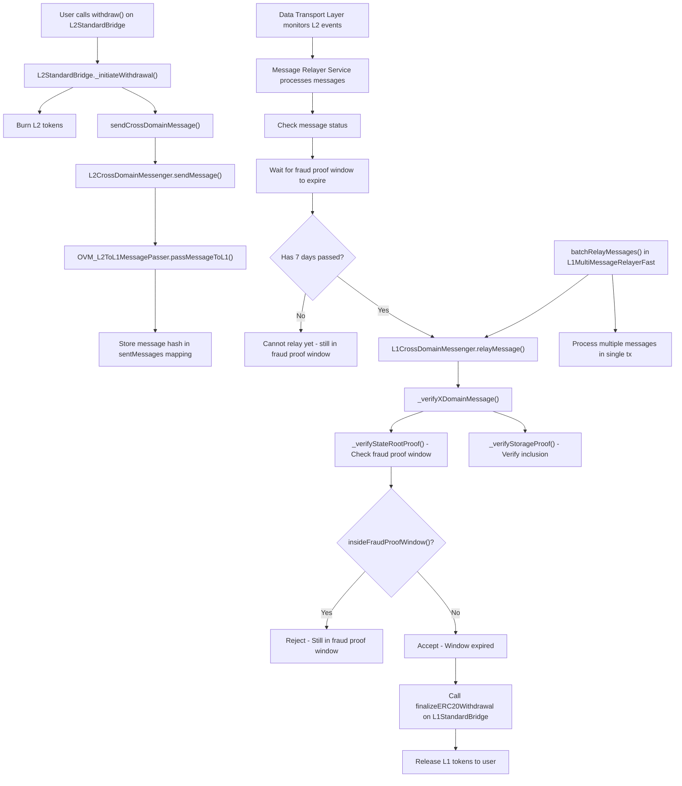

```mermaid
graph TD
 A["User calls withdraw() on L2StandardBridge"] --> B["L2StandardBridge._initiateWithdrawal()"]
 B --> C["Burn L2 tokens"]
 B --> D["sendCrossDomainMessage()"]
 D --> E["L2CrossDomainMessenger.sendMessage()"]
 E --> F["OVM_L2ToL1MessagePasser.passMessageToL1()"]
 F --> G["Store message hash in sentMessages mapping"]

H["Data Transport Layer monitors L2 events"] --> I["Message Relayer Service processes messages"]
I --> J["Check message status"]
J --> K["Wait for fraud proof window to expire"]
K --> L{"Has 7 days passed?"}
L -->|No| M["Cannot relay yet - still in fraud proof window"]
L -->|Yes| N["L1CrossDomainMessenger.relayMessage()"]
N --> O["_verifyXDomainMessage()"]
O --> P["_verifyStateRootProof() - Check fraud proof window"]
O --> Q["_verifyStorageProof() - Verify inclusion"]
P --> R{"insideFraudProofWindow()?"}
R -->|Yes| S["Reject - Still in fraud proof window"]
R -->|No| T["Accept - Window expired"]
T --> U["Call finalizeERC20Withdrawal on L1StandardBridge"]
U --> V["Release L1 tokens to user"]

W["batchRelayMessages() in L1MultiMessageRelayerFast"] --> N
W --> X["Process multiple messages in single tx"]
```
