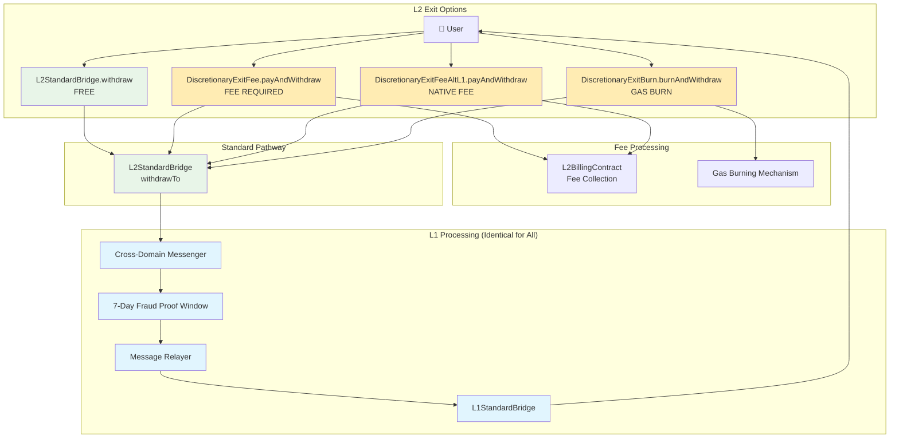
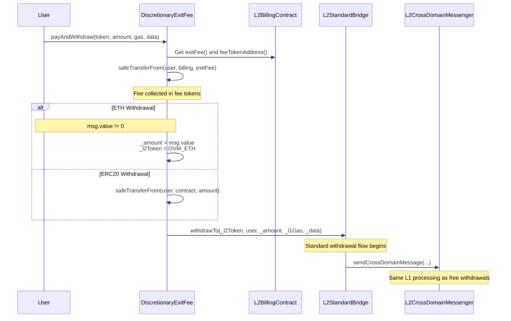
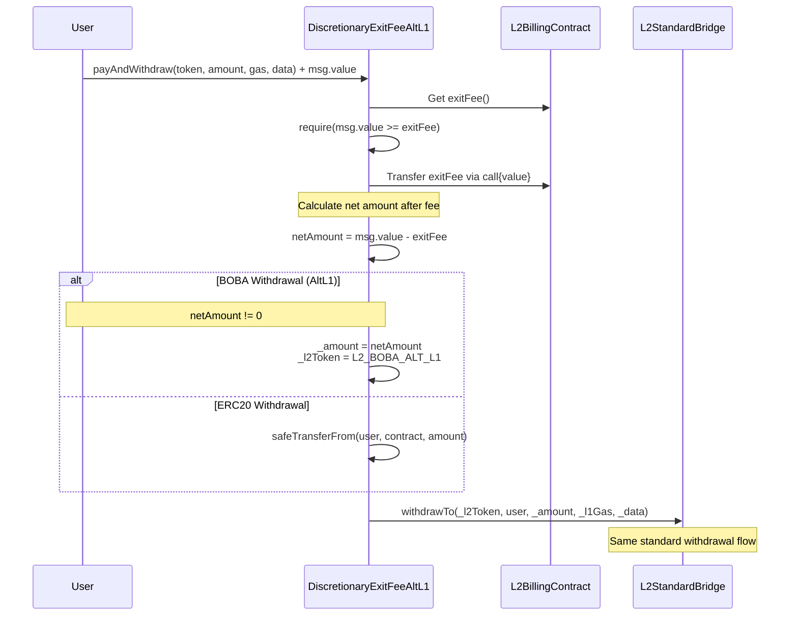
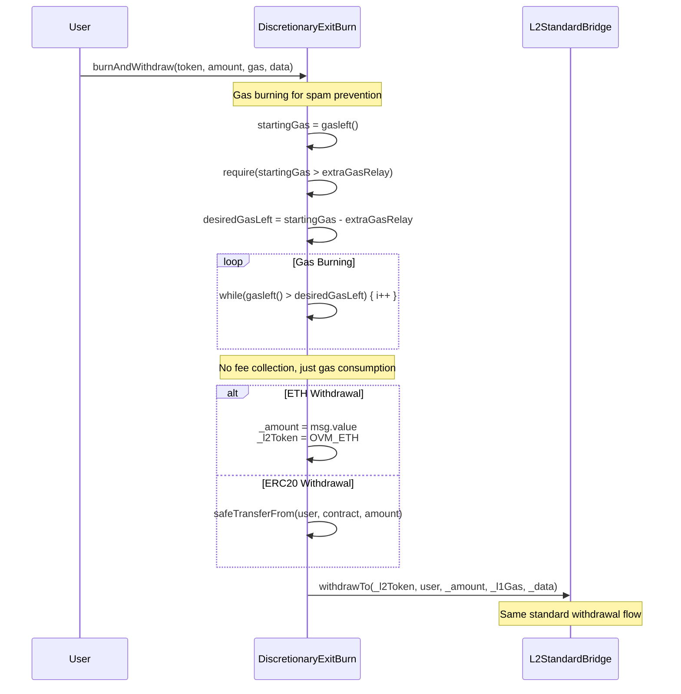

# Complete L2 Exit Flow Guide - Fee-Based Mechanisms

## Overview

This guide details the **fee-based exit mechanisms** in Boba Network. These are alternative withdrawal methods that charge fees but follow the **identical L1 processing pathway** as standard withdrawals.

## System Architecture



## Detailed Flow Analysis

### 1. DiscretionaryExitFee.payAndWithdraw()

**Purpose**: Fee-based withdrawal using fee tokens (like BOBA)

```solidity
function payAndWithdraw(
    address _l2Token,
    uint256 _amount,
    uint32 _l1Gas,
    bytes calldata _data
) external payable onlyWithBillingContract
```

**Flow**:


**Key Points**:
- **Fee Payment**: Uses `L2BillingContract` to collect fees in designated token
- **Token Handling**: Supports both ETH and ERC20 withdrawals
- **Standard Backend**: Calls `L2Bridge.withdrawTo()` - identical to free withdrawals

### 2. DiscretionaryExitFeeAltL1.payAndWithdraw()

**Purpose**: Fee-based withdrawal for alternative L1 networks (pays fee in native tokens)

```solidity
function payAndWithdraw(
    address _l2Token,
    uint256 _amount,
    uint32 _l1Gas,
    bytes calldata _data
) external payable onlyWithBillingContract
```

**Flow**:


**Key Differences from Standard ExitFee**:
- **Native Payment**: Fee paid in native L2 tokens (sent with transaction)
- **Net Amount**: Withdrawal amount is reduced by fee amount
- **AltL1 Focus**: Designed for alternative L1 networks like Avalanche, Fantom

### 3. DiscretionaryExitBurn.burnAndWithdraw()

**Purpose**: Spam prevention through gas burning mechanism

```solidity
function burnAndWithdraw(
    address _l2Token,
    uint256 _amount,
    uint32 _l1Gas,
    bytes calldata _data
) external payable
```

**Flow**:


**Key Features**:
- **No Fee Collection**: Uses gas burning instead of token fees
- **Spam Prevention**: Forces users to consume extra gas
- **Configurable**: `extraGasRelay` parameter set by gas price oracle owner

## L2BillingContract Details

The billing contract manages fee collection for the fee-based exits:

```solidity
contract L2BillingContract {
    address public feeTokenAddress;  // Token used for fees (e.g., BOBA)
    address public l2FeeWallet;      // Where fees are sent
    uint256 public exitFee;          // Current fee amount

    function collectFee() external;
    function withdraw() external;    // Withdraw collected fees
    function updateExitFee(uint256 _exitFee) external onlyOwner;
}
```

**Fee Management**:
- **Dynamic Pricing**: Exit fees can be updated by contract owner
- **Fee Collection**: Automated transfer to fee wallet
- **Threshold Withdrawal**: Fees withdrawn when balance ≥ 150 tokens

## L1 Processing (Identical for All Exit Types)

**Critical Understanding**: All exit mechanisms ultimately call `L2Bridge.withdrawTo()`, which means they all follow the **exact same L1 processing**:

### Phase 1: Cross-Domain Message Creation
```solidity
// In L2StandardBridge._initiateWithdrawal()
bytes memory message = abi.encodeWithSelector(
    IL1ERC20Bridge.finalizeERC20Withdrawal.selector,
    l1Token, _l2Token, _from, _to, _amount, _data
);
sendCrossDomainMessage(l1TokenBridge, _l1Gas, message);
```

### Phase 2: 7-Day Fraud Proof Window
- Message stored in `L2ToL1MessagePasser`
- State batch submitted to `StateCommitmentChain` on L1
- **7-day waiting period begins** (same for all exit types)

### Phase 3: Message Relay
- Message relayer checks `getMessageStatus()`
- When fraud window expires: calls `L1CrossDomainMessenger.relayMessage()`
- Verification: state root proof + storage inclusion proof

### Phase 4: L1 Finalization
```solidity
// In L1StandardBridge.finalizeERC20Withdrawal()
deposits[_l1Token][_l2Token] = deposits[_l1Token][_l2Token] - _amount;
IERC20(_l1Token).safeTransfer(_to, _amount);
emit ERC20WithdrawalFinalized(_l1Token, _l2Token, _from, _to, _amount, _data);
```

## L1 Requirements and Setup

### No Special L1 Components Required

The fee-based exits **do not require any special L1 infrastructure**. They use the standard:

- **StateCommitmentChain**: Same fraud proof window validation
- **L1CrossDomainMessenger**: Same message verification
- **L1StandardBridge**: Same token release mechanism
- **Message Relayer**: Same automated processing

### L1 Side Checklist

To complete fee-based withdrawals, ensure the same L1 components are healthy:

1. **✅ StateCommitmentChain**: Receiving state batches every ~30 minutes
2. **✅ Message Relayer**: Processing withdrawals after 7-day window
3. **✅ L1CrossDomainMessenger**: Verifying and executing messages
4. **✅ L1StandardBridge**: Releasing tokens to users

### Monitoring Fee-Based Exits

**Events to Monitor**:
```solidity
// From L2BillingContract
event CollectFee(address user, uint256 amount);
event UpdateExitFee(uint256 newFee);

// From Exit Contracts (same as standard)
event WithdrawalInitiated(address l1Token, address l2Token, address from, address to, uint256 amount, bytes data);

// L1 Completion (same as standard)
event ERC20WithdrawalFinalized(address l1Token, address l2Token, address from, address to, uint256 amount, bytes data);
```

**Fee Revenue Tracking**:
```solidity
// Query collected fees
uint256 collectedFees = IERC20(feeTokenAddress).balanceOf(billingContractAddress);

// Query fee parameters
uint256 currentExitFee = billingContract.exitFee();
address feeToken = billingContract.feeTokenAddress();
```

## Gas Considerations

### Standard vs Fee-Based Gas Costs

| Exit Type | Additional Gas Cost | Purpose |
|-----------|-------------------|---------|
| Standard Withdrawal | 0 | Free usage |
| DiscretionaryExitFee | ~50,000 gas | Fee token transfer |
| DiscretionaryExitFeeAltL1 | ~30,000 gas | Native token transfer |
| DiscretionaryExitBurn | Variable | Configurable gas burning |

### Gas Optimization Tips

1. **Batch Fee Collection**: Process multiple exits together
2. **Fee Token Approval**: Pre-approve fee tokens to save gas
3. **Gas Price Timing**: Use during low network congestion

## Integration Examples

### Frontend Integration

```typescript
// Check exit fee before withdrawal
const billingContract = new ethers.Contract(billingAddress, billingABI, provider);
const exitFee = await billingContract.exitFee();
const feeToken = await billingContract.feeTokenAddress();

// For DiscretionaryExitFee
const feeTokenContract = new ethers.Contract(feeToken, erc20ABI, signer);
await feeTokenContract.approve(exitFeeContract.address, exitFee);
await exitFeeContract.payAndWithdraw(l2Token, amount, l1Gas, data);

// For DiscretionaryExitFeeAltL1
const totalValue = amount.add(exitFee);
await exitFeeContract.payAndWithdraw(l2Token, amount, l1Gas, data, {value: totalValue});
```

### Backend Monitoring

```typescript
// Monitor fee collection
const filter = billingContract.filters.CollectFee();
billingContract.on(filter, (user, amount, event) => {
  console.log(`Fee collected: ${amount} from ${user}`);
  // Update revenue analytics
});

// Monitor withdrawal completion (same as standard)
const l1Bridge = new ethers.Contract(l1BridgeAddress, l1BridgeABI, l1Provider);
const completionFilter = l1Bridge.filters.ERC20WithdrawalFinalized();
l1Bridge.on(completionFilter, (l1Token, l2Token, from, to, amount, data) => {
  console.log(`Withdrawal completed: ${amount} ${l1Token} to ${to}`);
});
```

## Troubleshooting Fee-Based Exits

### Common Issues

1. **"Billing contract address is not set"**
   - Ensure `configureBillingContractAddress()` has been called
   - Verify billing contract is deployed and initialized

2. **"Insufficient fee tokens"**
   - User needs to hold enough fee tokens
   - Check token balance and allowance

3. **Fee-based exit stuck at same point as standard withdrawals**
   - This indicates L1 infrastructure issues, not fee mechanism problems
   - Follow standard withdrawal troubleshooting procedures

### Diagnostic Commands

```bash
# Check billing contract configuration
cast call $BILLING_CONTRACT "exitFee()" --rpc-url $L2_RPC

# Check fee token balance
cast call $FEE_TOKEN "balanceOf(address)" $USER_ADDRESS --rpc-url $L2_RPC

# Check if withdrawal reached L1 (same process as standard)
# Follow standard withdrawal monitoring procedures
```

---

## Summary

Fee-based exit mechanisms in Boba Network are **wrapper contracts** that:

1. **Collect fees** through various mechanisms (token transfer, native payment, gas burning)
2. **Call standard withdrawal functions** (`L2Bridge.withdrawTo()`)
3. **Use identical L1 processing** (7-day fraud window, message relayer, L1 finalization)

**For troubleshooting 17-day withdrawal delays**: The issue is with the underlying L1 infrastructure (sequencer, message relayer, etc.), not the fee mechanisms themselves. All withdrawal types are affected equally.
