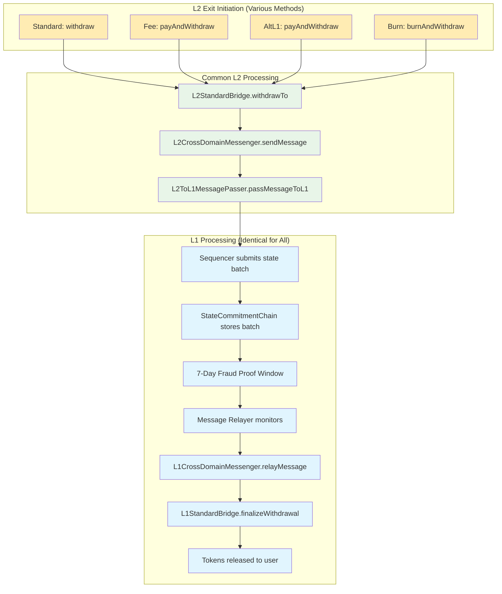

# L1 Processing Guide for All Exit Types

## Critical Understanding

**All L2 exit mechanisms (standard and fee-based) use IDENTICAL L1 processing.** Fee-based exits are wrappers that eventually call the same `L2StandardBridge.withdrawTo()` function.

## L1 Processing Pipeline



## L1 Components Required

### 1. StateCommitmentChain

**Purpose**: Stores L2 state commitments and enforces fraud proof window

**Contract**: Network-specific address (e.g., `0xeF85fA550e6EC5486121313C895EDe1005e2397f` for Boba BNB)

**Key Functions**:
```solidity
function appendStateBatch(bytes32[] memory _batch, uint256 _shouldStartAtElement) public;
function insideFraudProofWindow(ChainBatchHeader memory _batchHeader) public view returns (bool);
function verifyStateCommitment(bytes32 _element, ChainBatchHeader memory _batchHeader, ChainInclusionProof memory _proof) public view returns (bool);
```

**Configuration**:
```solidity
uint256 public FRAUD_PROOF_WINDOW = 604800; // 7 days in seconds
uint256 public SEQUENCER_PUBLISH_WINDOW = 1800; // 30 minutes
```

**Health Check**:
```bash
# Monitor StateBatchAppended events
curl -X POST https://api.bscscan.com/api \
  -d "module=logs&action=getLogs&address=0xeF85fA550e6EC5486121313C895EDe1005e2397f&topic0=0x16be4c5129a4e03cf3350262e181dc02ddfb4a6008d925368c0899fcd97ca9c5&fromBlock=latest-2880"
```

### 2. L1CrossDomainMessenger

**Purpose**: Verifies cross-domain messages and executes withdrawals

**Contract**: Network-specific address (e.g., `0x31338a7D5d123E18a9a71447136B54B6D28241ae` for Boba BNB)

**Key Functions**:
```solidity
function relayMessage(
    address _target,
    address _sender,
    bytes memory _message,
    uint256 _messageNonce,
    L2MessageInclusionProof memory _proof
) public nonReentrant whenNotPaused;
```

**Verification Process**:
```solidity
function _verifyXDomainMessage(bytes memory _xDomainCalldata, L2MessageInclusionProof memory _proof) internal view returns (bool) {
    return (_verifyStateRootProof(_proof) && _verifyStorageProof(_xDomainCalldata, _proof));
}

function _verifyStateRootProof(L2MessageInclusionProof memory _proof) internal view returns (bool) {
    IStateCommitmentChain ovmStateCommitmentChain = IStateCommitmentChain(resolve("StateCommitmentChain"));

    return (ovmStateCommitmentChain.insideFraudProofWindow(_proof.stateRootBatchHeader) == false &&
            ovmStateCommitmentChain.verifyStateCommitment(_proof.stateRoot, _proof.stateRootBatchHeader, _proof.stateRootProof));
}
```

### 3. L1StandardBridge

**Purpose**: Manages L1 token deposits/withdrawals and final token release

**Contract**: Network-specific address (e.g., `0x1E0f7f4b2656b14C161f1caDF3076C02908F9ACC` for Boba BNB)

**Key Functions**:
```solidity
function finalizeERC20Withdrawal(
    address _l1Token,
    address _l2Token,
    address _from,
    address _to,
    uint256 _amount,
    bytes calldata _data
) external onlyFromCrossDomainAccount(l2TokenBridge);

function finalizeETHWithdrawal(
    address _from,
    address _to,
    uint256 _amount,
    bytes calldata _data
) external onlyFromCrossDomainAccount(l2TokenBridge);
```

## L1 Processing Timeline

### Detailed Timeline Breakdown

| Phase | Duration | Description | Status Check |
|-------|----------|-------------|--------------|
| **L2 Initiation** | Instant | Exit called on L2 | `WithdrawalInitiated` event |
| **State Batch Wait** | 0-30 min | Wait for sequencer batch | Monitor `StateBatchAppended` |
| **Fraud Proof Window** | **7 days** | Challenge period | `insideFraudProofWindow()` |
| **Relay Processing** | 1-5 min | Message relayer execution | `RelayedMessage` event |
| **Total Time** | **~7 days** | Normal completion | Tokens in user wallet |

### Critical Path Dependencies

```mermaid
gantt
    title L1 Processing Critical Path
    dateFormat X
    axisFormat %d

    section L2 Processing
    Exit Initiated :milestone, m1, 0, 0d
    State Batch Submitted :milestone, m2, 0, 1d

    section L1 Challenge Period
    Fraud Proof Window :active, window, 0, 7d

    section L1 Completion
    Message Relay :milestone, m3, 7, 7d
    Tokens Released :milestone, m4, 7, 7d
```



## Message Relayer Service

### Purpose and Operation

The Message Relayer is an **off-chain service** that:
1. Monitors L2 withdrawal events
2. Waits for fraud proof window to expire
3. Constructs inclusion proofs
4. Calls `L1CrossDomainMessenger.relayMessage()`

### Service Configuration

```typescript
interface MessageRelayerConfig {
  l2RpcProvider: string;           // L2 network RPC
  l1Wallet: Wallet;               // L1 wallet with gas funds
  relayGasLimit: number;          // Gas limit for relay transactions
  minBatchSize: number;           // Minimum messages per batch
  maxWaitTimeS: number;           // Max wait before forcing batch
  fromL2TransactionIndex: number; // Starting L2 transaction
  pollingInterval: number;        // How often to check for new messages
  l1StartOffset: number;          // L1 block to start monitoring from
  filterEndpoint?: string;        // Optional message filtering
  maxGasPriceInGwei: number;      // Gas price limits
  isFastRelayer: boolean;         // Fast relayer mode
}
```

### Relayer Processing Logic

```typescript
// Simplified relayer logic
async function processWithdrawals() {
  while (running) {
    // Get new L2 withdrawal messages
    const messages = await getL2Messages(highestCheckedL2Tx);

    for (const message of messages) {
      // Check if withdrawal is ready to relay
      const status = await messenger.getMessageStatusFromContracts(message);

      if (status === MessageStatus.READY_FOR_RELAY) {
        // Generate inclusion proof
        const proof = await messenger.getMessageProof(message);

        // Relay message to L1
        await l1CrossDomainMessenger.relayMessage(
          message.target,
          message.sender,
          message.message,
          message.messageNonce,
          proof
        );
      }
    }

    await sleep(pollingInterval);
  }
}
```

## L1 Setup Requirements

### Infrastructure Components

#### 1. Sequencer Service
**Purpose**: Submits L2 state batches to L1 StateCommitmentChain

**Requirements**:
- L1 wallet with sufficient gas funds (>1 ETH/BNB)
- Reliable L1 RPC connection
- L2 RPC connection for state retrieval
- Automated batch submission every ~30 minutes

**Health Check**:
```bash
# Check recent state batch submissions
cast logs --from-block $(cast block-number) --to-block $(cast block-number) \
  --address 0xeF85fA550e6EC5486121313C895EDe1005e2397f \
  --rpc-url https://bsc-dataseed.binance.org
```

#### 2. Message Relayer Service
**Purpose**: Processes individual withdrawals after fraud window

**Requirements**:
- L1 wallet with gas funds (>0.5 ETH/BNB)
- L1 and L2 RPC connections
- State proof generation capability
- Automated processing of ready messages

**Health Check**:
```bash
# Check relayer service status
systemctl status message-relayer

# Check recent relay activity
cast logs --from-block $(( $(cast block-number) - 1000 )) \
  --address 0x31338a7D5d123E18a9a71447136B54B6D28241ae \
  --topic 0x4641df4a962071e12719d8c8c8e5ac7fc4d97b927346a3d7a335b1f7517e133c
```

#### 3. Data Transport Layer (DTL)
**Purpose**: Synchronizes L1/L2 events for monitoring

**Requirements**:
- L1 and L2 RPC connections
- Database for event storage
- Event indexing and querying capability

### Network-Specific Configurations

#### Boba BNB (BSC)
```yaml
L1 Network: Binance Smart Chain (Chain ID: 56)
L2 Network: Boba BNB (Chain ID: 56288)
StateCommitmentChain: 0xeF85fA550e6EC5486121313C895EDe1005e2397f
L1CrossDomainMessenger: 0x31338a7D5d123E18a9a71447136B54B6D28241ae
L1StandardBridge: 0x1E0f7f4b2656b14C161f1caDF3076C02908F9ACC
Fraud Proof Window: 604800 seconds (7 days)
```

#### Boba Ethereum
```yaml
L1 Network: Ethereum (Chain ID: 1)
L2 Network: Boba Ethereum (Chain ID: 288)
StateCommitmentChain: [Network-specific address]
L1CrossDomainMessenger: [Network-specific address]
L1StandardBridge: [Network-specific address]
Fraud Proof Window: 604800 seconds (7 days)
```

## L1 Monitoring and Health Checks

### Critical Health Metrics

#### 1. State Batch Frequency
```bash
# Expected: ~48 batches per day (every 30 minutes)
EVENTS_24H=$(curl -s "https://api.bscscan.com/api?module=logs&action=getLogs&address=0xeF85fA550e6EC5486121313C895EDe1005e2397f&topic0=0x16be4c5129a4e03cf3350262e181dc02ddfb4a6008d925368c0899fcd97ca9c5&fromBlock=latest-2880" | jq '.result | length')

if [ $EVENTS_24H -lt 30 ]; then
  echo "⚠️ Low state batch frequency: $EVENTS_24H/day"
else
  echo "✅ State batch frequency normal: $EVENTS_24H/day"
fi
```

#### 2. Message Relay Rate
```typescript
// Check if messages are being relayed after fraud window
const readyMessages = await getReadyMessages();
const recentRelays = await getRecentRelayEvents();

if (readyMessages.length > 0 && recentRelays.length === 0) {
  console.log('⚠️ Messages ready but not being relayed');
} else {
  console.log('✅ Message relayer active');
}
```

#### 3. Service Wallet Balances
```typescript
// Monitor gas funds for critical services
const sequencerBalance = await l1Provider.getBalance(sequencerAddress);
const relayerBalance = await l1Provider.getBalance(relayerAddress);

const minBalance = ethers.utils.parseEther("0.1");

if (sequencerBalance.lt(minBalance)) {
  console.log('🔴 Sequencer low on gas funds');
}

if (relayerBalance.lt(minBalance)) {
  console.log('🔴 Message relayer low on gas funds');
}
```

### Automated Monitoring Setup

```typescript
// Example monitoring service
class L1HealthMonitor {
  async checkStateCommitmentChain() {
    const recentBatches = await this.getRecentStateBatches(24); // 24 hours
    const expectedBatches = 48; // Every 30 minutes

    return {
      healthy: recentBatches.length >= expectedBatches * 0.8,
      batchCount: recentBatches.length,
      lastBatchTime: recentBatches[0]?.timestamp
    };
  }

  async checkMessageRelayer() {
    const readyMessages = await this.getReadyMessages();
    const stuckMessages = readyMessages.filter(m =>
      Date.now() - m.readyTime > 3600000 // 1 hour
    );

    return {
      healthy: stuckMessages.length === 0,
      readyCount: readyMessages.length,
      stuckCount: stuckMessages.length
    };
  }
}
```

## Troubleshooting L1 Issues

### Common L1 Problems

#### 1. Sequencer Not Submitting Batches
**Symptoms**: No `StateBatchAppended` events for >2 hours

**Diagnosis**:
```bash
# Check sequencer service
systemctl status boba-sequencer

# Check sequencer wallet balance
cast balance $SEQUENCER_ADDRESS --rpc-url https://bsc-dataseed.binance.org

# Check L1 connectivity
curl -X POST https://bsc-dataseed.binance.org \
  -H "Content-Type: application/json" \
  -d '{"jsonrpc":"2.0","method":"eth_blockNumber","params":[],"id":1}'
```

**Solution**:
```bash
# Restart sequencer service
systemctl restart boba-sequencer

# Fund sequencer wallet if needed
# Verify L1 RPC endpoint
```

#### 2. Message Relayer Not Processing
**Symptoms**: Messages stuck at `READY_FOR_RELAY` status

**Diagnosis**:
```bash
# Check relayer service
systemctl status message-relayer

# Check relayer logs
journalctl -u message-relayer -f

# Check relayer wallet balance
cast balance $RELAYER_ADDRESS --rpc-url https://bsc-dataseed.binance.org
```

**Solution**:
```bash
# Restart message relayer
systemctl restart message-relayer

# Fund relayer wallet
# Check relayer configuration
```

### Emergency Procedures

#### Manual Message Relay
```typescript
// If automated relayer is down, manually relay messages
const withdrawalTx = "0x..."; // L2 withdrawal transaction hash
const message = await messenger.getMessageFromL2Tx(withdrawalTx);
const proof = await messenger.getMessageProof(message);

await l1CrossDomainMessenger.relayMessage(
  message.target,
  message.sender,
  message.message,
  message.messageNonce,
  proof,
  { gasLimit: 2000000 }
);
```

#### Batch Processing for Backlog
```typescript
// Process multiple stuck withdrawals
const readyMessages = await getReadyMessages();
const batchSize = 10;

for (let i = 0; i < readyMessages.length; i += batchSize) {
  const batch = readyMessages.slice(i, i + batchSize);
  await processBatch(batch);
}
```

---

## Summary

L1 processing for all exit types (standard and fee-based) is **identical**:

1. **StateCommitmentChain**: Enforces 7-day fraud proof window
2. **Message Relayer**: Processes withdrawals after window expires
3. **L1CrossDomainMessenger**: Verifies and executes withdrawals
4. **L1StandardBridge**: Releases tokens to users

**For 17-day delays**: The issue is with L1 infrastructure (sequencer, relayer, or connectivity), not the exit mechanisms themselves. Focus troubleshooting on these core L1 components.
